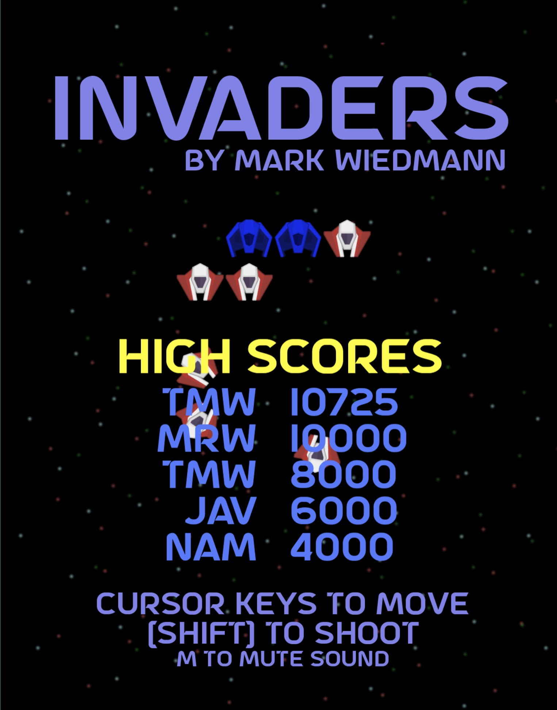
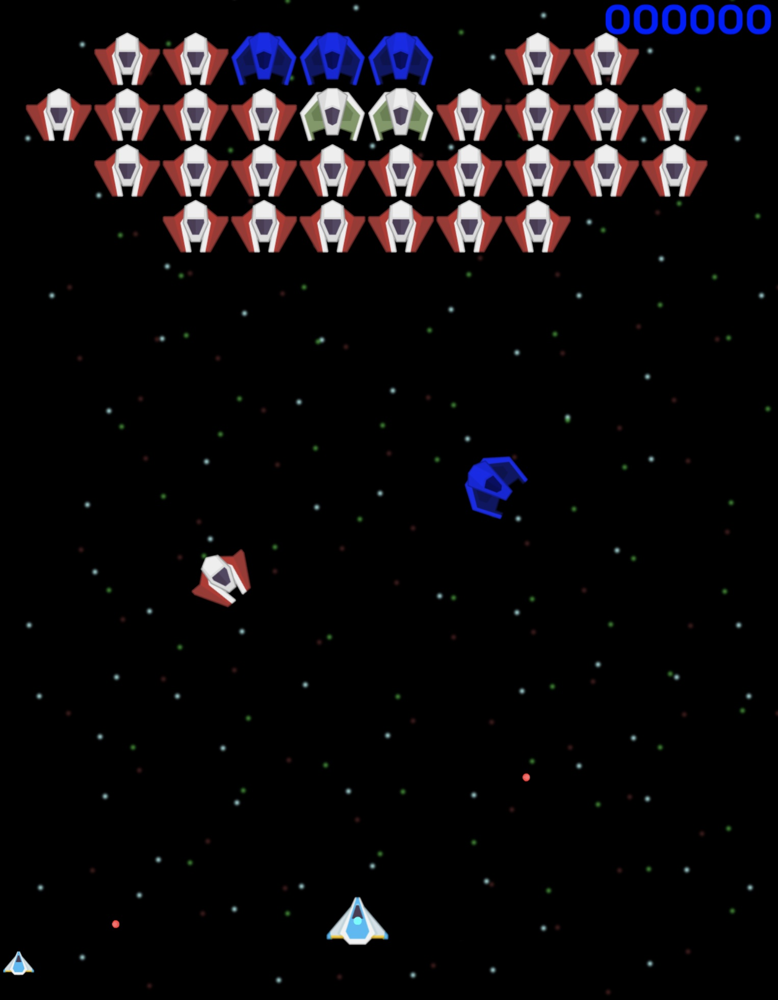

# Invaders

A Galaga like arcade game written in TypeScript using the Phaser 3 game engine.

# Running and building

`yarn` to install all dependencies. This project uses yarn berry and pnp.

`yarn start` to run the game locally. It will spin up a dev server on localhost:3000.

`yarn prod` to run a production optimized version of the game locally. It will spin up a dev server on localhost:3000.

`yarn build` to build a the game for deployment. Files will be placed in a `dist` folder.